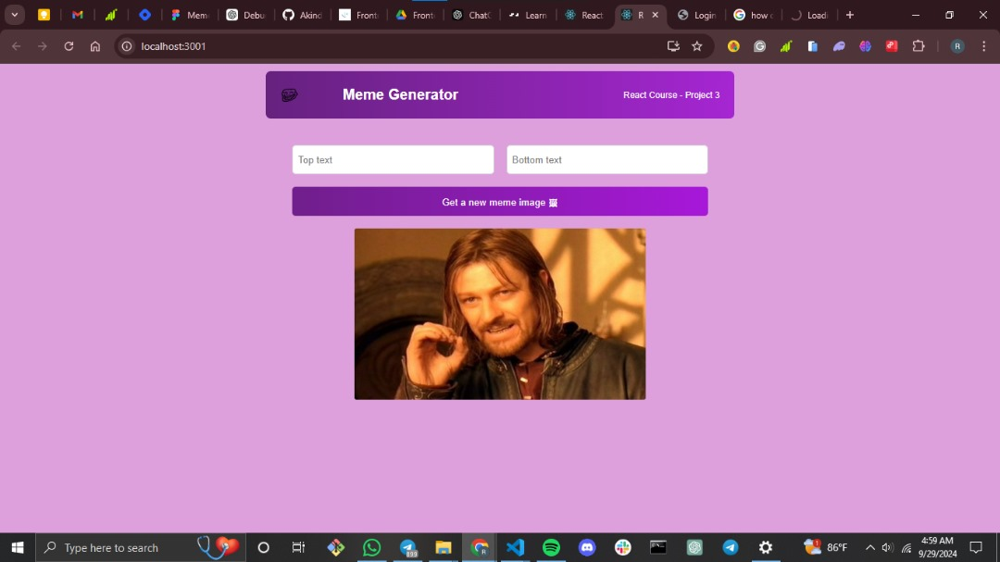
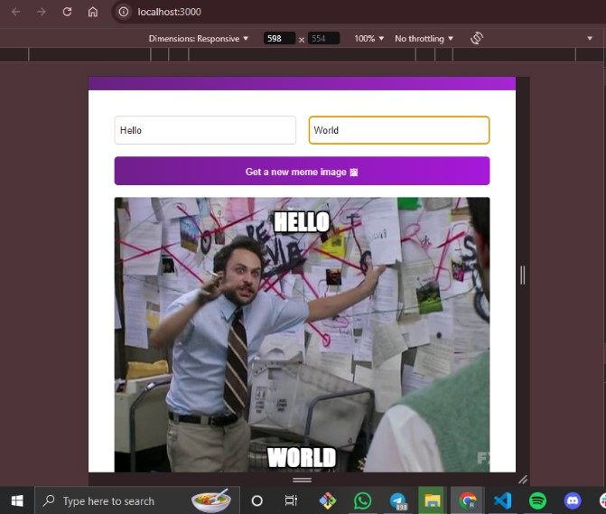

#  MEME_GENERATING_APP

## Table of contents

  

## Overwiew

Users will be able to:

  - Generate new meme image by clicking on the "Get new meme image".
  - Input text into the input boxes and be displayed at the top and bottom of the meme image.

### Screenshot (desktop and mobile view)

  

  

### Links

  ![Code_Link] (https://github.com/Akindewa/Meme_Generating_App.git)
  
  ![Live_Link] (https://github.com/Akindewa/Meme_Generating_App.git)

### Built with

  - React
  - Javascript
  - HTML
  - CSS
